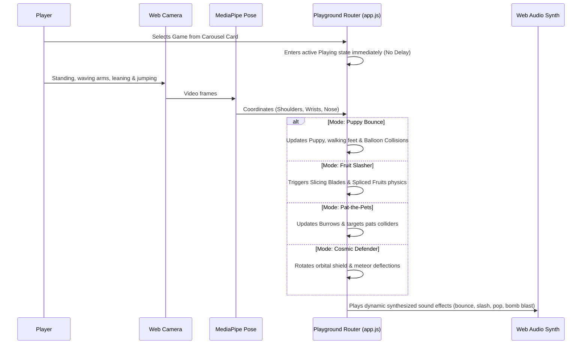

# 🎈 Kids Motion Playground (Nex-Style)

### 🔗 Play Live Now: [https://ibrezm1.github.io/Nexter-Playground-Kids/](https://ibrezm1.github.io/Nexter-Playground-Kids/)

A high-performance, real-time, motion-controlled games playground for kids built using vanilla HTML5, CSS3, Javascript, **MediaPipe Pose tracking**, and **Web Audio API**.

Live-stream your movements to control puppets, slice flying fruits, pat popping hamsters, and deflect descending asteroid showers in space! No consoles required—just your browser and a web camera!

---

## 🎮 Playground Games Suite

1. **🐶 Puppy Bounce**: Lean side-to-side to guide the puppy, wave your hands to swat balloons with floppy proportionate paws, and physically jump to make the puppy leap up and bounce high balloons!
2. **🍉 Fruit Slasher**: Wave your arms like laser swords (wrist tracking) to slice flying melons and bananas into physically dividing slices while dodging spikey fuses bombs.
3. **🐹 Pat-the-Pets**: Reach high and low to pat cartoon bunnies, hamsters, and birds popping out of grass burrows, avoiding prickly hedgehogs.
4. **🚀 Cosmic Defender**: Stand back and lean left/right to revolve a glowing orbital neon space shield around your spaceship cockpit reactor, deflecting falling meteors away.

---

## 🚀 Instant Deployment to GitHub Pages (`github.io`)

Because this project is built entirely on vanilla front-end scripts, it requires **zero build steps** and hosts flawlessly on GitHub Pages!

### Easy Setup Steps:

1. **Create a GitHub Repository**:
   - Go to GitHub and create a new repository (e.g., `kids-motion-playground`).
2. **Push the Code**:
   - Initialize git in your local project folder and push it to your new repository:
     ```bash
     git init
     git add .
     git commit -m "Initial release of Kids Motion Playground"
     git branch -M main
     git remote add origin https://github.com/YOUR_USERNAME/kids-motion-playground.git
     git push -u origin main
     ```
3. **Enable GitHub Pages**:
   - On your GitHub repository page, navigate to **Settings** (tab at the top).
   - Scroll down to the sidebar and click **Pages** (under the "Code and automation" section).
   - Under **Build and deployment**, select **Deploy from a branch** under Source.
   - Under **Branch**, select `main` (and `/root` folder) and click **Save**.
4. **Play!**:
   - The live playground is hosted at:
     **[https://ibrezm1.github.io/Nexter-Playground-Kids/](https://ibrezm1.github.io/Nexter-Playground-Kids/)**

---

## 🏗️ Detailed Architecture & System Flow



### Architectural Breakdown:
1. **Camera Sensor Core (`pose-tracker.js`)**: Manages webcam frames and feeds them to the MediaPipe Pose model. It computes normalized horizontal and vertical coordinates of the shoulders and wrists, alongside a highly robust relative nose-height threshold to determine jumping.
2. **Gateway Game Router (`app.js`)**: The heartbeat coordinator of the playground. It receives coordinates from the pose tracker and routes them into the active game mode's unique rendering layers at a fluid 60 FPS.
3. **HTML5 Interactive Canvas (`game-canvas`)**: High-performance canvas handling custom vector drawings (e.g. animated walk-cycles for the puppy dog, twin glowing laser swords, rotating cockpit dials) and complex physical formulas (e.g. asteroid deflections, split-fruit trajectory gravity).
4. **Web Audio FX Synthesizer (`SoundSynth`)**: Encompasses real-time procedural synthesizers wrapped in robust error bounds. It generates playful SFX dynamically on-the-fly, completely bypassing static file dependencies.

---

## ⌨️ Fallback Interactive Controls

If you are playing on a device without a camera, or camera access is blocked:
- **Movement (Left/Right)**: Use the `ArrowLeft` and `ArrowRight` keys.
- **Leap Jumps**: Use the `Spacebar`.
- **Puppet Arm Swats**: Move your mouse cursor across the screen to direct the puppy's paws and slash fruit paths dynamically!

---

## 🛠️ Technology Highlights

*   **Zero-Lag Skeletal Tracking**: Directly fetches light-weight MediaPipe Pose models asynchronously in the background.
*   **Web Audio SFX Synthesizers**: Procedurally synthesizes sound effects (pop, bounce, slash, explosion, ticker click) using the browser's native Web Audio API, avoiding broken static audio file paths.
*   **Unified Game Router State**: Single cohesive gateway routing engine driving all four games at a fluid 60 FPS on standard canvasses.
